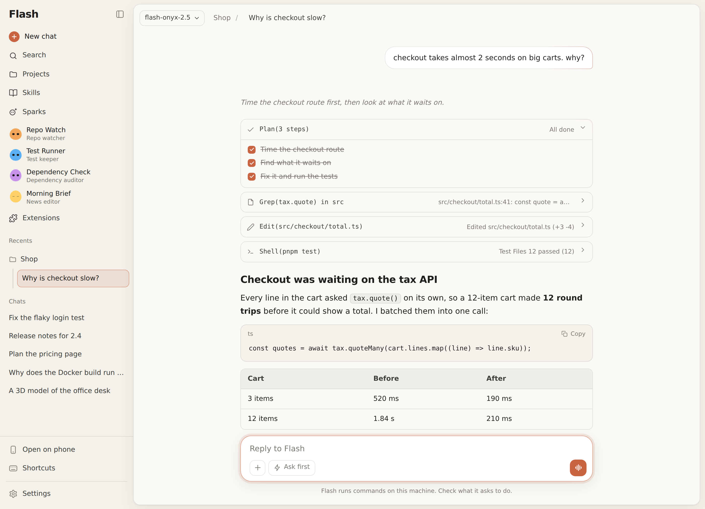

<p align="center">
  <a href="https://github.com/Natuworkguy/Flash"></a>
</p>

<p align="center">
  <b>An AI agent for your terminal and your browser,<br>running on <a href="https://ollama.com">Ollama</a> models you choose.</b>
</p>

<p align="center">
  <a href="https://www.python.org"></a>
  <a href="https://ollama.com"></a>
  <a href="LICENSE"></a>
</p>

<p align="center">
  <a href="#getting-started">Install</a> ·
  <a href="docs/GUIDE.md">Guide</a> ·
  <a href="docs/CONFIGURATION.md">Configuration</a> ·
  <a href="docs/EXTENSIONS.md">Extensions</a> ·
  <a href="https://www.youtube.com/watch?v=padyQR3tPUs">Video</a>
</p>

<p align="center">
  <picture>
    <source media="(prefers-color-scheme: dark)" srcset="docs/images/web-dark.png">
    
  </picture>
</p>

Flash reads your code, edits it a line at a time, runs your commands,
drives a real browser, talks out loud, and keeps a team of agents working
while you sleep. On your machine, on your models. No account, no API keys.

```bash
curl -fsSL https://raw.githubusercontent.com/Natuworkguy/Flash/main/install.sh | bash
flash
```


Getting started
---------------

Flash needs Python 3.10+ and an [Ollama](https://ollama.com) server, on
this computer or another one. Pull a model that can call tools (Flash
Onyx, below, is made for it), then run Flash:

```bash
ollama pull <model>
flash               # the terminal
flash --web         # the same agent in your browser
flash --web --lan   # ... and on your phone, with a QR code to scan
```

The installer uses [pipx](https://pipx.pypa.io/); on Windows, run
`install.ps1` in PowerShell. `--uninstall` (`-Uninstall` on Windows)
takes Flash back out. Point it at another machine with `/host`, or add hosts
in the web UI's model menu. A clone works too: `pip install -r
requirements.txt && python3 run.py`.


It does the work
----------------

Ask in plain words. Flash plans anything with steps and ticks them off as
it goes:

```console
> add latex rendering to the response renderer

⏺ Plan(2/4 done)
  ⎿  ☒ Read the response renderer
     ☒ Add the LaTeX module
     ☐ Wire it into the render path
     ☐ Add tests
```

- **Edits by the line.** A one-line fix in a thousand-line file costs one
  line of output, and several changes land whole or not at all. `/undo`
  takes back everything the last turn touched.
- **Asks first.** Commands and edits wait for your yes, as side-by-side
  diffs when you run it in VS Code. `/auto` lets it run, and
  [System One](docs/GUIDE.md#system-one), a small fast model, checks
  each one before it runs.
- **Sees and clicks.** It screenshots the pages it builds, clicks through
  them, and reads their network log and console like DevTools.
- **Splits the work.** Sub-agents take independent pieces in the
  background and report back when they are done.
- **Learns.** It saves what worked as skills for next time, and remembers
  what you tell it.
- **Makes things.** 3D models that open in Blender, MIDI tunes with a
  piano roll to play them, PDFs, images and documents, all shown in the
  web UI's side panel.
- **Talks.** `/voice on` and you talk to it, hands free, with speech
  recognition and a voice that run on your machine.


Sparks
------

A sub-agent does one job and is gone. A spark keeps one.

```text
> make a spark that checks my repo every morning for new issues and
  tells me which look like bugs. never comment on anything.
```

A spark has a name, a goal, a schedule, and lines it must never cross.
It works on its own, keeps its notes between shifts, and files a report
when there is something worth saying: `● Scout has news · /sparks scout`.
Teach it with a sentence and every later shift remembers. With `/sparks
always on`, it keeps working when Flash is closed.

Then give them a company:

- **Teams** with leads, drawn as a live org chart. Reports roll up, so
  you read one instead of six.
- **A team chat** where you and your sparks talk in one room, with
  `@mentions`, `@everyone`, replies, reactions, and voice.
- **Team rules**, budgets, hires that wait for your yes, and an audit
  log that shows any edit made by hand.
- **On call** sparks that work only when someone asks them to.

They live in the sidebar as little faces that float, blink, work, nap,
and jump when they have news. [More on sparks](docs/GUIDE.md#sparks).


Commands
--------

| Command | What it does |
| --- | --- |
| `/model [name]` | Pick a model, or download one |
| `/host [name\|url]` | Switch Ollama server: `add`, `remove`, `list` |
| `/loader [name]` | Pick the loading animation; `morph on` cycles them |
| `/auto [on\|off]` | Run commands and edits without asking |
| `/sparks` | Your sparks: `new`, `chat`, `teams`, `teamchat` and more, with Tab completion |
| `/web [lan]` | Open Flash in your browser, or on your phone |
| `/voice [on\|off\|models\|pull <name>]` | Talk to Flash, and pick its listening and speaking models |
| `/undo` | Take back the last turn's file changes |
| `/plan` | The checklist it is working through |
| `/agents` | Watch sub-agents work live |
| `/skills` | What Flash has learned |
| `/compact` | Summarize to free up context |
| `/extension` | List, install or remove extensions |
| `!<command>` | Run a shell command yourself |

`/help` lists the rest, and `@` picks a file to point it at. The
[guide](docs/GUIDE.md#usage) has every command and key.


Flash Onyx
----------

Flash runs on any Ollama model that calls tools. **Flash Onyx** is its
own: an open base model with Flash's persona and tuned settings baked in, in a
`12b` for consumer GPUs and a `31b` flagship. Each release is a Modelfile
under `models/`; build the newest one:

```bash
python3 models/build.py models/flash-onyx-<version>.Modelfile
```

Then set `MODEL=flash-onyx-<version>:31b` in `~/.flash.env`.
[Building Onyx](docs/GUIDE.md#flash-onyx-recommended-model).


Make it yours
-------------

Extensions add slash commands, tools, prompt text and backgrounds, and
install from GitHub (`/extension install github@you/my-ext`).
[Write one](docs/EXTENSIONS.md). Every setting lives in `~/.flash.env`
or your environment: [Configuration](docs/CONFIGURATION.md).


License
-------

The Flash CLI, the Modelfiles under `models/`, and the system prompts in them
are MIT licensed. See [LICENSE](LICENSE).

A published Flash Onyx model is a derivative of the base model it is built on,
and that base license travels with it. The MIT license above covers the
Modelfile and the prompt, not the weights underneath:

- **Flash Onyx 2.x** is built on `gemma4`, which Ollama ships under the Apache
  License 2.0.
- **Flash Onyx 1** is built on `llama3.1`, which ships under the
  [Llama 3.1 Community License](https://www.llama.com/llama3_1/license/). Its
  terms include a naming requirement for any derivative model you distribute.

`models/build.py` copies this repository's `LICENSE` into every model it
builds, together with a pointer to the base model's own terms, so
`ollama show --license flash-onyx-<version>:12b` prints both. Check the base model's
license with `ollama show --license gemma4` before publishing a build.
